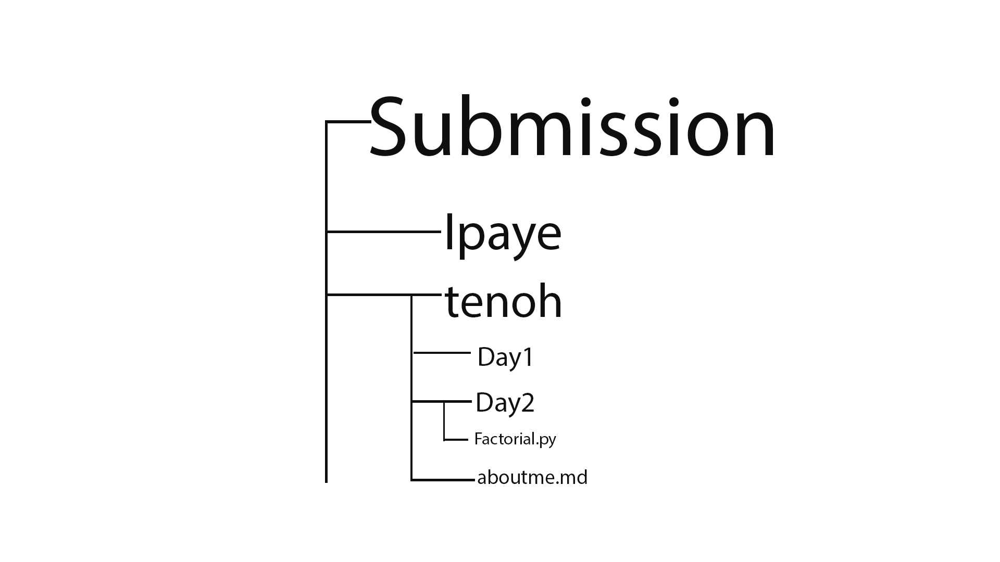

# Welcome to Consonance 100 Days of code Challenge 🚩

This README explains how to get started with the 100 Days of Code challenge, and how to become take part in it. By participating in the **100  Days of Code Challenge**, you are to abide by the [code of conduct](./.github/CODE_OF_CONDUCT.md).

**PRO-TIP** please check [our guide](./.github/guildlines.md) on taking part in this

# How To Get Started

- Fork this repository.

- In your fork, in the `submissions` directory, create a new directory  whose name is `YOUR GITHUB USERNAME`.

- In this directory, create a new file with the solution of each daily task. Example: `Day_1_solution.py`

* You can also create an `about.md` file to introduce yourself to the community. In this file, the structure should be.
  * Introduction  
  * Interest  
  * Some other fun details such as favourite emoji. 

- The Daily tasks are found in [DAILY_TASKS.md](DAILY_TASKS.md). look through the file and solve each one of them.

- Start a [pull request](./.github/pull-request-template.md) following the template given.

# Overview of submission structure

# Keeping your Fork in Sync

As more content is added to this repository and more people contribute, your fork will fall out of date. This can sometimes lead to tricky situations with your pull requests. It's recommended to occasionally sync your fork with this [repository](https://help.github.com/articles/syncing-a-fork/).
